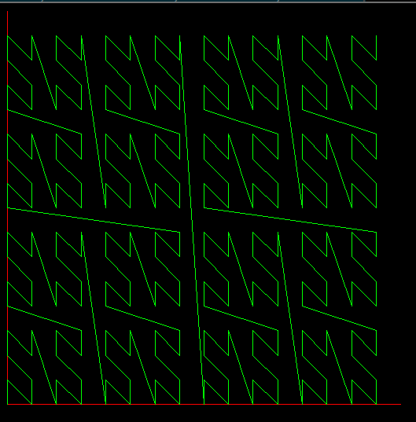

This is a short program to satisfy a mathematical curiosity and practice Haskell.

After watching [this video](https://www.youtube.com/watch?v=DuiryHHTrjU) on Hilbert Curves, and seeing that space filling curves are just functions from ℝ to ℝ^2 with some extra properties, I was curious whether the following function from would have some of the same properties:

* Take the binary expansion of a number from 0 to 1. 
* Take every second digit as part of the result's x coordinate.
* Take the others as the y coordinate.

e.g. 0.abcdefgh -> 0.aceg x 0.bdfh

The requirements for a space filling curve ([14:00 in the video](https://www.youtube.com/watch?v=DuiryHHTrjU#t=14m)) are

1. It's a function from ℝ to ℝ^2.
2. It's a curve (it's continuous).
3. It fills every point in the unit square.

I was pretty sure it would work, but wasn't confident and also had no idea what this function looked like. Lacking a good program to draw this in and also wanting to practice Haskell (particularly drawing), I decided to write it myself.

It turns out it's not continuous at 0.10000000, since 0.10000000 gets mapped to the bottom of the screen and 0.01111111 goes to the top. Oh well.

It still has some pretty unexpected similarities to the Hilbert curve. It's the same idea of self-repetition, but each group of 4 is in a different order and there's no rotation.

Also I learned lots of Haskell, so definitely still a success.
